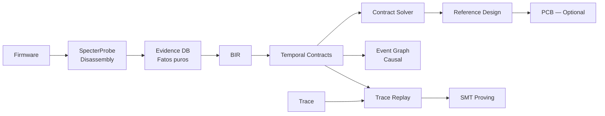

# B.A.S.E. — Behavioral ASIC Synthesis Engine

[](https://github.com/Eternet-Mycelium-Network/B.A.S.E./actions/workflows/ci.yml)
[](LICENSE.md)

**Transform hardware behavior into new PCB + firmware.**

> *"O que este hardware faz?" em vez de "Como este hardware foi implementado?"*

**160+ testes · 13 crates · 12 comandos CLI · 3 gerações de arquitetura**

---

## Pipeline

```bash
Firmware → analyze → Evidence DB → BIR → Contracts → Solver → Reference Design
                                                              ↓
                                                         [PCB/FW — opcional]
```

## Quick Start

```bash
git clone https://github.com/Eternet-Mycelium-Network/B.A.S.E..git
cd B.A.S.E.
cargo build -p base-cli
```

### Análise com disassembly real

```bash
base analyze firmware.bin --disasm --dot -o output/
# → 520 funções, 35K instruções, 757 MMIO candidates
# → behavior_graph.dot + event_graph.dot
```

### Pipeline completa

```bash
base pipeline firmware.bin --disasm -o output/
```

### Replay de trace contra contratos

```bash
base replay trace.csv --contracts contracts.yaml
# → contract_violations.json (Passo 11)
```

### Prova formal via SMT

```bash
base prove contracts.yaml --deadlock
# → deadlock_proof.smt (Passo 12)
```

### Reference Design

```bash
base design hardware_spec.yaml
# → reference_design.yaml (saída principal)
```

---

## Arquitetura (v3.2 — Evidence-Driven + Scientific)



### Fundamento Matemático

O B.A.S.E. é informado pela **Paleocomputação Estrutural** (Anacroclastia), uma disciplina formal que trata binários como artefatos geológicos de um processo de erosão compilatória. A métrica de **Tensão Ψ** quantifica a distância entre evidência observada e modelo:

```text
Ψ(B, H) = ∫ δ(ω_obs, ω_H) dμ
confidence = max(0, 1 - Ψ/(1+Ψ))
```

---

## 12 Comandos CLI

| Comando | Descrição |
|---------|-----------|
| `analyze` | Analyze firmware → produce HardwareSpec + Evidence DB |
| `synth` | Synthesize HardwareSpec → component mapping |
| `pcb` | Generate KiCad PCB (engineering draft) |
| `fw` | Generate bootloader, HAL, drivers, devicetree, Zephyr |
| `check` | Validate new hardware against original traces |
| `evolve` | Analyze bottlenecks and suggest upgrades |
| `pipeline` | Run full end-to-end pipeline |
| `reconstruct` | Recursive refinement loop until convergence |
| `replay` | Replay trace against temporal contracts |
| `prove` | Prove contracts via SMT (Z3) |
| `design` | Generate reference design (saída principal) |
| `event-graph` | Export causal event graph (DOT/Mermaid) |
| `bir` | BIR: validate, compile, export |

---

## Mercados

| Mercado | Problema | Solução B.A.S.E. |
|---------|----------|-----------------|
| 🏭 Preservação Industrial | ASICs de máquinas antigas param de ser fabricados | PCB + firmware compatível com componentes modernos |
| 🔒 Forense / Segurança | Análise de firmware sem código fonte | HardwareSpec + Event Graph + Contratos |
| 🎓 Educação / Pesquisa | Ferramentas didáticas para engenharia reversa | Pipeline visual (DOT/Mermaid) + métrica formal Ψ |
| ☁️ SaaS | PMEs sem engenheiro de firmware | Análise como serviço (envia firmware, recebe design) |

Mais detalhes em [`COMMERCIAL.md`](COMMERCIAL.md).

---

## Licença

AGPLv3 — [LICENSE.md](LICENSE.md)

Para uso proprietário sem compartilhamento de modificações, licença comercial disponível.
