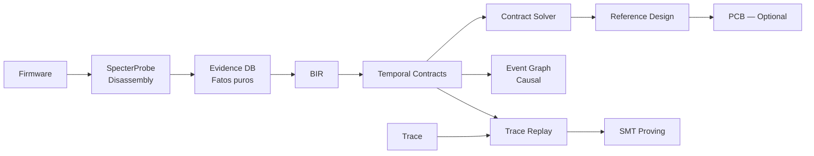

# B.A.S.E. — Behavioral ASIC Synthesis Engine

[](https://github.com/Eternet-Mycelium-Network/B.A.S.E./actions/workflows/ci.yml)

**Transform hardware behavior into new PCB + firmware.**

> *"O que este hardware faz?" em vez de "Como este hardware foi implementado?"*

**160 testes · 13 crates · 12 comandos CLI · 3 gerações de arquitetura**

---

## Pipeline

```bash
Firmware → analyze → Evidence DB → BIR → Contracts → Solver → Reference Design
                                                              ↓
                                                         [PCB/FW — opcional]
```

## Quick Start

```bash
git clone https://github.com/Eternet-Mycelium-Network/B.A.S.E..git
cd B.A.S.E.
cargo build -p base-cli
```

### Análise com disassembly real

```bash
base analyze firmware.bin --disasm --dot -o output/
# → 520 funções desassembladas, 35K instruções, 757 MMIO candidates
# → behavior_graph.dot + event_graph.dot
```

### Pipeline completa

```bash
base pipeline firmware.bin --disasm -o output/
```

### Replay de trace contra contratos

```bash
base replay trace.csv --contracts contracts.yaml
# → contract_violations.json
```

### Prova formal via SMT

```bash
base prove contracts.yaml --deadlock
# → deadlock_proof.smt
```

### Reference Design

```bash
base design hardware_spec.yaml
# → reference_design.yaml (engineering draft)
```

### Event Graph causal

```bash
base event-graph contracts.yaml trace.csv --format dot
# → event_graph.dot (WRITE → DMA_START → DMA_COMPLETE → IRQ)
```

### BIR — Behavioral IR

```bash
base bir device.bir.yaml --validate --dot --to-legacy
```

### Loop de refinamento recursivo

```bash
base reconstruct spec.yaml --threshold 0.9 --max-iterations 10
```

---

## Commands

| Comando | Descrição |
|---------|-----------|
| `analyze` | Analyze firmware → produce HardwareSpec + Evidence DB |
| `synth` | Synthesize HardwareSpec → component mapping |
| `pcb` | Generate KiCad PCB (engineering draft) |
| `fw` | Generate bootloader, HAL, drivers, devicetree, Zephyr |
| `check` | Validate new hardware against original traces |
| `evolve` | Analyze bottlenecks and suggest upgrades |
| `pipeline` | Run full end-to-end pipeline |
| `reconstruct` | Recursive refinement loop until convergence |
| `replay` | Replay trace against temporal contracts |
| `prove` | Prove contracts via SMT (Z3) |
| `design` | Generate reference design (saída principal) |
| `event-graph` | Export causal event graph (DOT/Mermaid) |
| `bir` | BIR: validate, compile, export |

---

## Arquitetura (v3.2 — Evidence-Driven + Scientific)



### Princípios

| Geração | Abordagem | Status |
|---------|-----------|--------|
| v1 (Sprints 0-7) | Pipeline linear: analyze → synth → pcb → fw | ✅ |
| v2 (12 Fases) | BIR + Knowledge Graph + Digital Twin + Feedback Loop | ✅ |
| v3.1 (Evidence) | Evidence DB + Contract Solver + Reference Design | ✅ |
| v3.2 (Scientific) | Temporal Contracts + Event Graph + Trace Replay + SMT | ✅ |

---

## Casos de Uso

- **Preservação de Hardware**: ASICs de consoles retrô → PCB compatível
- **Modernização**: Power Mac G5, DEC Alpha → Cortex-A + DDR5 + NVMe
- **Fork de Hardware**: Xbox 360, PS3 → reconstruir em FPGA + MCU

## Crates

| Crate | Tests | Descrição |
|-------|-------|-----------|
| `base-core` | 77 | Core: Evidence DB, BIR, Contracts, Solver, Digital Twin, KG, SMT |
| `base-bir` | 13 | Behavioral IR: tipos, validador, contratos temporais |
| `base-bsl` | 6 | BSL Language: parser, compiler |
| `base-pcb` | 15 | Gerador KiCad: S-expression, schematic, BOM, PCB, DRC |
| `base-fw` | 13 | Firmware sintético: bootloader, HAL, drivers, devicetree |
| `base-check` | 20 | Validação: trace Saleae/PCAP/JSON, comparator, HTML report |
| `base-evolve` | 7 | Evolução: bottleneck analysis, trade-offs, migration |
| `base-cli` | 3 | CLI: 12 subcomandos |
| `base-hil` | 6 | HIL Cluster: RP2350 probe firmware, host agent |
| `base-bir` | — | Acima |
| `specterprobe` | — | Disassembly ARM64: Capstone, CFG, MMIO scan |
| **Total** | **160** | |

## Licença

AGPL-3.0
