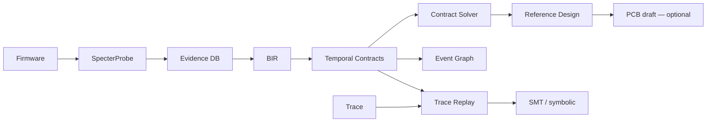

# B.A.S.E. — Behavioral ASIC Synthesis Engine

[](https://github.com/bmcc-DEV/B.A.S.E./actions/workflows/ci.yml)
[](https://github.com/bmcc-DEV/B.A.S.E./actions/workflows/formal.yml)
[](LICENSE.md)
[](https://github.com/bmcc-DEV/B.A.S.E./releases/tag/v1.0.0)

> *"O que este hardware faz?" em vez de "Como este hardware foi implementado?"*

**Motor de engenharia reversa comportamental assistida** — evidência → contratos → Reference Design.

> **Tag estável [`v1.0.0`](https://github.com/bmcc-DEV/B.A.S.E./releases/tag/v1.0.0)** · [CHANGELOG](CHANGELOG.md) · [Path to v1.0](base-vault/20%20-%20Path%20to%20v1.0/20.00%20-%20Index.md)
>
> Wedge forense auditável: RP2040 UART/SPI (gates + goldens `diff`) + STM32 USART1 / SPI2 / I2C1 / TIM2 opt-in + triple smoke + reconstruct honesto + `base hil` **EXPERIMENTAL**.
>
> Demo: [Playbook v1.0](base-vault/20%20-%20Path%20to%20v1.0/20.20%20-%20Forensic%20Playbook.md) · [SOW industrial](base-vault/20%20-%20Path%20to%20v1.0/20.21%20-%20SOW%20Industrial%20Checklist.md) · [COMMERCIAL.md](COMMERCIAL.md).
>
> **Não** é gerador de PCB fabricável, ASIC drop-in, SaaS turnkey nem HIL production. **v1.0 ≠** produto industrial completo.

---

## O que funciona hoje

Fonte da verdade: [**Maturity Matrix**](base-vault/12%20-%20Path%20to%20Real/12.02%20-%20Maturity%20Matrix.md)

### CLI / pipeline

| Área | Estado |
|------|--------|
| `analyze` + Evidence DB + `--disasm` / `--mmio-traces` / `--classify` | **REAL\*** no wedge ARM (RP + STM32) |
| `design` / `synth` + component DB + contratos | **REAL\***; depende da qualidade do spec |
| `replay` / `prove` (simbólico; Z3 opcional) / `event-graph` / `bir` | **REAL\*** — fixtures + goldens `diff` |
| `check` | **REAL\*** — sem self-pass; dual fixture |
| `pipeline` | **REAL\*** — orquestra estágios; `--pcb` / `--evolve` opt-in |
| `fw` | **PARCIAL** — skeleton **host-testable** (`make host`); ≠ silício |
| `pcb` | **SCAFFOLD** — engineering draft KiCad (`NOT FABRICABLE`) |
| `evolve` | Scaffold — off por default |
| `reconstruct` | **PARCIAL** — refine local; `--continuous` para em estagnação (`stop_reason`); **≠** auto-fix |
| `base hil` | **EXPERIMENTAL** — enumerate / `--mock-flash`; sem flash automático sem probe |

\*REAL = funcional e auditável no wedge piloto, não universal.

### Wedges / smokes

| Wedge | Smoke | Goldens |
|-------|-------|---------|
| RP2040 UART | `./examples/pilot/run.sh` | `expected/` (`diff`) |
| RP2040 SPI0 | `./examples/pilot/run_t1_b2.sh` | (gate) |
| STM32 USART1 | `./examples/pilot_stm32/run.sh` | `expected/` |
| STM32 USART+SPI2 | `./examples/pilot_stm32/run_w1_spi.sh` | `expected_spi/` (`diff`) |
| STM32 USART+I2C1 | `./examples/pilot_stm32/run_x3_i2c.sh` | `expected_i2c/` (`diff`) |
| STM32 USART+SPI+I2C | `./examples/pilot_stm32/run_y3_triple.sh` | — |
| STM32 USART+TIM2 | `./examples/pilot_stm32/run_z2_tim.sh` | — (`@ 0x40000000`) |

Goldens = **verificar** (`diff`), nunca sobrescrever no smoke. Gates permanentes: `run.sh` + `run_t1_b2.sh`.

`--classify` aceita `uart` / `spi` / `i2c` / `timer` (`tim`), inclusive por página MMIO 4K.

Docs: [Path to v1.0](base-vault/20%20-%20Path%20to%20v1.0/20.00%20-%20Index.md) · [Sprint Board](base-vault/20%20-%20Path%20to%20v1.0/20.04%20-%20Sprint%20Board.md) · [Case study](base-vault/12%20-%20Path%20to%20Real/12.20%20-%20Pilot%20Case%20Study.md) · [Roadmap](base-vault/05%20-%20Implementation/05.01%20Roadmap.md)

---

## Pipeline

```text
Firmware → analyze → Evidence DB → BIR → Contracts → Solver → Reference Design
                                                              ↓
                                                    [PCB/FW draft — opcional]
```

---

## Quick Start

```bash
git clone https://github.com/bmcc-DEV/B.A.S.E..git
cd B.A.S.E.
cargo build -p base-cli
```

### Piloto RP (gates — start here)

```bash
./examples/pilot/run.sh
./examples/pilot/run_t1_b2.sh
# → examples/pilot/out/CASE_SUMMARY.md
```

### Piloto STM32 (opt-in)

```bash
./examples/pilot_stm32/run.sh          # USART1
./examples/pilot_stm32/run_w1_spi.sh   # + SPI2 + goldens SPI
./examples/pilot_stm32/run_x3_i2c.sh   # + I2C1 + goldens I2C
./examples/pilot_stm32/run_y3_triple.sh
./examples/pilot_stm32/run_z2_tim.sh   # + TIM2
```

Demo guiada: [Playbook forense v1.0](base-vault/20%20-%20Path%20to%20v1.0/20.20%20-%20Forensic%20Playbook.md).

### Análise

```bash
base analyze firmware.bin --disasm --dot -o output/
# MMIO + classify (exemplo STM32 dual USART+TIM):
base analyze fw.bin --mmio-traces mmio.json \
  --classify '0x40013000=uart,0x40000000=timer' -o output/
# → hardware_spec.yaml + evidence_db.yaml
```

### Reference Design

```bash
base design output/hardware_spec.yaml \
  --preferred-manufacturer STMicroelectronics -o output/design/
# → reference_design.yaml (engineering draft — NOT FABRICABLE)
```

### Replay / prova

```bash
base replay trace.csv --contracts contracts.yaml -o violations.json
base prove contracts.yaml -o proof/   # simbólico por default
base event-graph trace.csv -o graph/
```

### Reconstruct / HIL (limites honestos)

```bash
base reconstruct output/analyze/hardware_spec.yaml \
  --continuous --threshold 0.99 -o /tmp/recon/
# → stop_reason / estagnação — ≠ auto-fix

base hil enumerate -o /tmp/hil/
base hil flash /tmp/x.bin --mock-flash -o /tmp/hil/
# EXPERIMENTAL — mock_dry_run ≠ silício / production
```

### Prova formal Z3 (opcional)

Default `cargo test` / CI principal **não** exige Z3. Com libz3 no sistema:

```bash
# Debian/Ubuntu: sudo apt-get install -y libz3-dev
cargo test -p base-core --features solver_z3 --lib smt
```

Job isolado: [`.github/workflows/formal.yml`](.github/workflows/formal.yml) (`workflow_dispatch` + nightly). Detalhes: [SMT Real](base-vault/11%20-%20B.A.S.E.%20v3.2%20Scientific/11.04%20-%20SMT%20Real.md).

---

## Arquitetura



### Tensão Ψ

```text
Ψ(B, H) = ∫ δ(ω_obs, ω_H) dμ
confidence = max(0, 1 - Ψ/(1+Ψ))
```

---

## CLI

| Comando | Notas |
|---------|-------|
| `analyze` | HardwareSpec + Evidence DB; `--mmio-traces`, `--classify`, `--disasm` |
| `synth` / `design` | Mapping + Reference Design; `--preferred-manufacturer`, `--pcb` |
| `replay` / `prove` / `event-graph` | Contratos temporais; goldens nos smokes |
| `bir` | Validate / compile BSL / export |
| `fw` | Draft C + `make host` |
| `pcb` | Draft KiCad (`NOT FABRICABLE`) |
| `check` | Validação dual; sem self-pass |
| `pipeline` | Orquestra estágios; PCB/evolve opt-in |
| `reconstruct` | Refine estrutural; `--continuous` ≠ auto-fix |
| `hil` | **EXPERIMENTAL** — enumerate / flash mock |
| `evolve` | Scaffold — off por default |

Estado detalhado: [Maturity Matrix](base-vault/12%20-%20Path%20to%20Real/12.02%20-%20Maturity%20Matrix.md).

---

## Mercados (realista)

| Mercado | Papel em v1.0 |
|---------|----------------|
| Forense / segurança | **Wedge principal** — Evidence + contratos + design (RP + STM32) |
| Educação / pesquisa | Pipeline visual + Ψ + pilots |
| Preservação industrial | **Consultoria** + [SOW v1.0](base-vault/20%20-%20Path%20to%20v1.0/20.21%20-%20SOW%20Industrial%20Checklist.md) — não turnkey |
| SaaS PME | Adiado — não disponível como turnkey |

Detalhes: [`COMMERCIAL.md`](COMMERCIAL.md).

### Claims proibidos

- PCB fabricável / Gerber de fábrica  
- ASIC drop-in / “substitui silício industrial”  
- HIL production / flash automático sem probe  
- SaaS turnkey / auto-fix completa  
- “v1.0 = produto industrial completo”  
- Amiga/CD32 / G5 / Xbox / Alpha como wedge de release  

---

## Documentação

| Doc | Papel |
|-----|-------|
| [Maturity Matrix](base-vault/12%20-%20Path%20to%20Real/12.02%20-%20Maturity%20Matrix.md) | Fonte da verdade técnica |
| [Playbook v1.0](base-vault/20%20-%20Path%20to%20v1.0/20.20%20-%20Forensic%20Playbook.md) | Demo forense 1 página |
| [SOW v1.0](base-vault/20%20-%20Path%20to%20v1.0/20.21%20-%20SOW%20Industrial%20Checklist.md) | Checklist consultoria |
| [Path to v1.0](base-vault/20%20-%20Path%20to%20v1.0/20.00%20-%20Index.md) | Plano Z0–Z5 (fechado) |
| [Pilot Case Study](base-vault/12%20-%20Path%20to%20Real/12.20%20-%20Pilot%20Case%20Study.md) | Case RP |
| [CHANGELOG](CHANGELOG.md) | Histórico de tags |
| [Vault index](base-vault/00%20-%20Index.md) | Índice Obsidian |

---

## Licença

AGPLv3 — [LICENSE.md](LICENSE.md)

Uso proprietário sem compartilhar modificações: licença comercial disponível (ver [COMMERCIAL.md](COMMERCIAL.md)).
