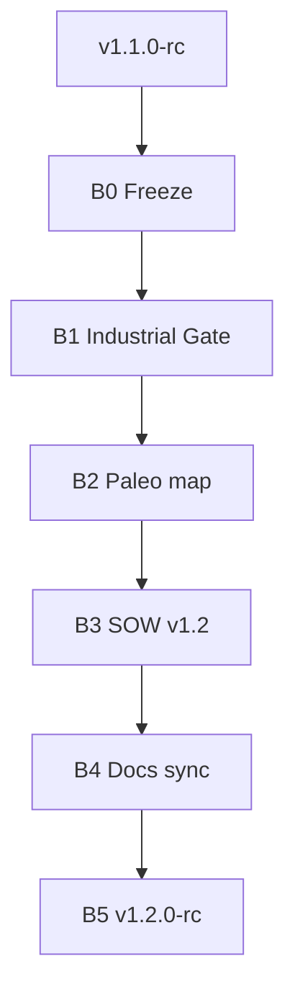

# 22 — Path to v1.2

> *v1.1-rc estável + **SOW Industrial Gate** — checklist para promover claims (PCB / HIL / auto-fix) só com evidência + SOW; inspira-se em Paleocomputação (fósseis, Ψ, falsificação) sem virar PaleoCLI.*

**Herdado de:** [[21 - Path to v1.1/21.00 - Index|Path to v1.1]] ✅ · tag git `v1.1.0-rc`  
**Status:** Path to v1.2 **B0–B5 done** · tag git **`v1.2.0`** (promovido de `v1.2.0-rc`). Segue: [[23 - Path to v1.3/23.00 - Index|Path to v1.3]].
**Baseline de regressão:** `./examples/pilot/run.sh` + `./examples/pilot/run_t1_b2.sh` + `./examples/pilot_study/run_study.sh`

## Norte v1.2

| É | Não é |
|---|--------|
| Gate contratual para claims industriais | Implementar PCB fabricável nesta path |
| Mapa Paleo → B.A.S.E. (honestidade) | PaleoCLI / Nethergate no wedge |
| Pré-condições lab + aceite humano | HIL production ligado no CI |
| SOW v1.2 com “promover só se…” | Auto-fix completa |

## Mapa

| Nota | Papel |
|------|-------|
| [[22.01 - Master Plan\|Master Plan v1.2]] | L32–L33, sprints B0–B5 |
| [[22.02 - Maturity Delta\|Maturity Delta]] | Deltas vs v1.1 |
| [[22.03 - Acceptance Criteria\|Acceptance]] | DoD |
| [[22.04 - Sprint Board\|Sprint Board]] | Kanban B0–B5 |
| [[22.30 - SOW Industrial Gate\|SOW Industrial Gate]] | **Entrega central** |
| [[22.31 - Paleo to BASE Map\|Paleo → B.A.S.E.]] | Conceitos do PDF → gates |
| [[22.20 - Forensic Playbook\|Playbook v1.2]] | Demo + gate |
| [[22.21 - SOW Industrial Checklist\|SOW v1.2]] | Checklist contrato |

## Fluxo

## Princípio guia

1. **Não quebrar** gates forenses + study.
2. Claims industriais = **falsificáveis** (método científico / Paleo §1.2): hipótese → evidência → aceite — ou bloqueio honesto.
3. Reconstrução = **minimizar Ψ**, não “código original único” (Paleo Axioma 2.4).
4. Esta path é **documental**; implementação de fab/flash/fix fica para paths futuros *após* o gate passar.

[[21 - Path to v1.1/21.00 - Index]] ← Anterior · [[22.01 - Master Plan]] →
