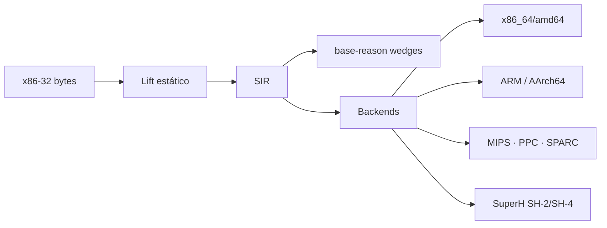

# Master Plan — v1.7 Static Recomp

## Camada L38

> *“Dado um blob x86 freestanding, produzir SIR auditável e ASM equivalente por ISA alvo — sem fingir Win32 completo.”*

## Entregas

| Entrega | Sprint | Status |
|---------|--------|--------|
| Vault Path v1.7 + honesty recomp | R0 | ✅ |
| Crate `base-recomp` (SIR + TargetIsa + emitters stub) | R0 | ✅ |
| Lifter x86 subset → SIR + testes | R1 | ✅ |
| CLI `base recomp lift/emit` | R1 | ✅ |
| Backend x86_64 roundtrip smoke | R2 | ✅ |
| Backends ARM + AArch64 subset | R3 | ✅ |
| Backends MIPS + PPC + SPARC subset | R4 | ✅ |
| Backend SuperH (SH-2/SH-4) + tag `v1.7.0-rc` | R5 | ✅ (tag git = release step) |

## Honesty permanente

| Flag | Valor |
|------|-------|
| `generates_os` | `false` |
| `auto_fix_complete` | `false` |
| `static_recomp_complete` | `false` até R5+ com critérios |
| `win32_abi_complete` | `false` (fora do norte v1.7) |
| `runs_any_pe` | `false` |

**amd64 ≡ x86_64** — um único `TargetIsa::X86_64`.

## Anti-padrões

- Prometer Chrono/Legends/Saturn via recomp Win32 no SH-2
- Confundir lift incompleto com decompilação “source recovery”
- Embutir Wine/DXVK no crate
- Tratar JIT dinâmico como entrega desta path

## Dependências

- Capstone (opcional feature) alinhado a SpecterProbe — R1+
- `base-core` honesty · `base-reason` para Questions de lift fail
- Assemblers externos (gas/`as`) só na validação host — não obrigatórios no lib

[[27.00 - Index]]
