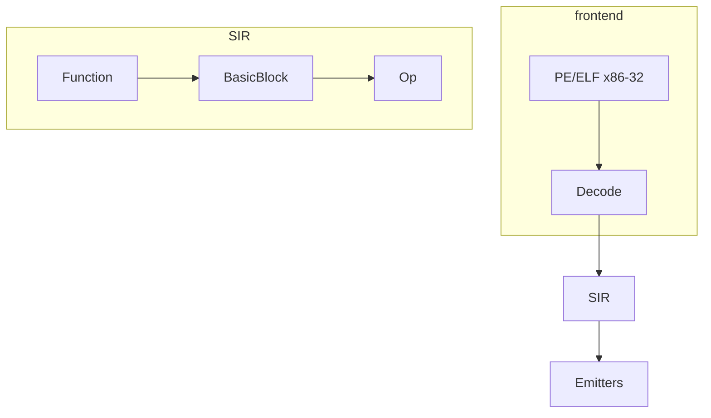

# SIR — Static Intermediate Representation

## Papel

SIR é a ponte **estática** entre bytes x86 e backends multi-ISA.

- **Não** é BIR (comportamento de HW / MMIO).
- **Não** é LLVM IR completo (pode baixar para LLVM depois).
- **É** um CFG de blocos + ops tipadas o suficiente para emitir ASM.

## Unidades

| Tipo | Conteúdo |
|------|----------|
| `Module` | Funções + símbolos |
| `Function` | Nome, entry, blocos |
| `BasicBlock` | Lista de `Op`, sucessor(es) |
| `Op` | `Nop` · `Ret` · `MovImm` · `BinAlu` · `Load` · `Store` · `Branch` · `Call` · `Unknown` |
| `VReg` | Registo virtual (SSA light) |
| `LiftGap` | Opcode/região não liftable → wedge |

## Relação com o resto do B.A.S.E.

| Artefacto | Uso |
|-----------|-----|
| SpecterProbe Capstone | Decode ARM64 HW; recomp reutiliza Capstone para x86 em R1+ |
| BIR | HW behavior — paralelo, não substituto |
| `base-reason` | Questions quando `LiftGap` / ABI missing |
| Honesty | Nunca marcar `static_recomp_complete` sem goldens por alvo |

## Saídas

| Artefacto | Formato |
|-----------|--------|
| `*.sir.json` / `*.sir.yaml` | SIR serializado |
| `emit_<isa>.s` | ASM textual por backend |
| `LIFT_REPORT.md` | Gaps + honesty |

[[27.00 - Index]]
