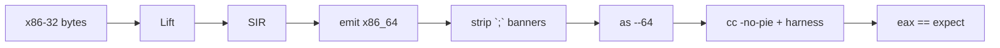

# R2 — x86_64 host roundtrip

## Fluxo

## Artefactos

| Ficheiro | Papel |
|----------|--------|
| `tests/goldens/x86_64_*.s` | Diff estável do corpo ASM |
| `roundtrip::smoke_x86_64` | Assemble + link + run |
| `base recomp roundtrip` | CLI opt-in |

## Honesty

Continua `static_recomp_complete: false` — subset freestanding, não PE/Win32.

[[27.00 - Index]] · [[27.04 - Sprint Board]]
